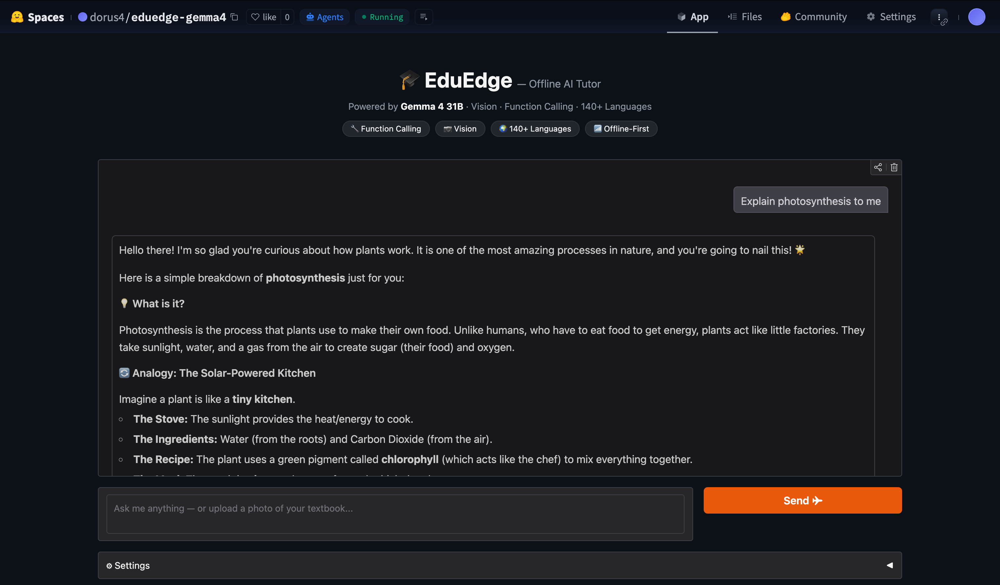

# EduEdge — Offline AI Tutor for Underserved Communities

> **The Gemma 4 Good Hackathon** · [kaggle.com/competitions/gemma-4-good-hackathon](https://www.kaggle.com/competitions/gemma-4-good-hackathon)
> Deadline: May 18, 2026

---

## The Problem

More than **300 million students** worldwide have no reliable internet access. For them, personalised tutoring—the most effective form of learning—is out of reach. A student in a rural school, a refugee learning a new language, a first-generation college student studying at midnight: all share the same barrier.

Modern AI tutoring tools require cloud connectivity, subscriptions, and often function only in English. They are designed for the already-connected world.

## Our Solution

**EduEdge** is an offline-first, multimodal AI tutor that runs entirely on a local device—no internet required after a one-time setup. Powered by **Gemma 4 E4B via Ollama**, it fits comfortably on a low-end laptop (≈10 GB RAM) and delivers frontier-level intelligence at the edge.



### Key Features

| Feature | How it works |
|---|---|
| 📷 **Multimodal input** | Photograph a textbook page, handwritten note, or diagram — Gemma 4's native vision encoder understands it |
| 🔧 **Function calling** | Structured tools generate quizzes, study plans, and concept breakdowns via Gemma 4's native function-calling |
| 🌍 **Any language** | Gemma 4 is trained on 140+ languages; students can ask in their native tongue |
| 🧠 **Thinking mode** | `<\|think\|>` enables Gemma 4's chain-of-thought reasoning for hard problems |
| 📶 **Offline-first** | Ollama serves the model locally; zero cloud dependency after `ollama pull` |
| ⚡ **Edge-optimized** | E4B (Effective 4B) — 4.5B effective parameters, 9.6 GB, 128K context window |

### Target Tracks

- **Future of Education** ($10,000) — adaptive offline tutoring
- **Digital Equity & Inclusivity** ($10,000) — multilingual, device-agnostic access
- **Ollama Special Technology** ($10,000) — showcase of Gemma 4 via Ollama

---

## Architecture

```
Student (browser)
       │  Gradio UI (src/app.py)
       ▼
 EduTutor (src/tutor.py)
       │  ollama.Client  (REST → localhost:11434)
       ▼
  Gemma 4 E4B  ←── native function calling ──→  Tools (src/tools.py)
   (Ollama)                                      • generate_quiz
                                                 • create_study_plan
                                                 • explain_concept
```

**Data flow for a photo of a textbook page:**
1. Student uploads image → Gradio encodes to base64
2. `EduTutor.chat()` builds a multimodal message (image + text)
3. Gemma 4 vision encoder processes the image (variable-resolution tokens)
4. Model may invoke a tool (e.g. `generate_quiz`) → result injected back
5. Final answer streamed to the chat UI

---

## Project Structure

```
gemma-4-good-hackathon/
├── README.md
├── requirements.txt         # Python dependencies
├── .env.example             # Environment variable template
├── setup.sh                 # One-command setup
├── src/
│   ├── __init__.py
│   ├── app.py               # Gradio web interface
│   ├── tutor.py             # Core Gemma 4 + Ollama logic
│   └── tools.py             # Native function-calling tools
├── notebooks/
│   └── 01_model_exploration.ipynb   # Model capability exploration
├── data/                    # Local datasets / sample inputs
└── assets/                  # Screenshots and demo materials
```

---

## Quick Start

### Prerequisites
- macOS / Linux / Windows (WSL2)
- Python ≥ 3.11
- [Ollama](https://ollama.com/download) installed
- ≈ 10 GB free disk space (for the model)

### Install & Run

```bash
# 1. Clone
git clone <your-repo-url>
cd gemma-4-good-hackathon

# 2. One-command setup (installs deps + pulls Gemma 4 E4B)
bash setup.sh

# 3. Launch the app
python -m src.app

# Open http://localhost:7860
```

### Model Options

Edit `.env` to choose a different model size:

| Model | Size | RAM needed | Best for |
|---|---|---|---|
| `gemma4:e2b` | 7.2 GB | 8 GB | Raspberry Pi / phones |
| `gemma4:e4b` | 9.6 GB | 12 GB | Laptop (**recommended**) |
| `gemma4:26b` | 18 GB | 24 GB | Workstation (MoE) |
| `gemma4:31b` | 20 GB | 32 GB | High-end workstation |

---

## Gemma 4 Features Used

### 1. Native Multimodal Vision
```python
user_msg = {
    "role": "user",
    "content": "What does this diagram show?",
    "images": [base64_encoded_image],
}
```

### 2. Native Function Calling
```python
tools = [{"type": "function", "function": {"name": "generate_quiz", ...}}]
response = client.chat(model="gemma4:e4b", messages=history, tools=tools)
if response.message.tool_calls:
    result = dispatch(tc.function.name, tc.function.arguments)
```

### 3. Thinking Mode (chain-of-thought)
```
System prompt starts with <|think|> to enable internal reasoning
for hard multi-step problems (math, logic, science).
```

### 4. Recommended Sampling (per Ollama docs)
```python
Options(temperature=1.0, top_p=0.95, top_k=64)
```

---

## Roadmap

- [x] Project structure & core tutor logic
- [x] Gradio web interface
- [x] Function calling: quiz, study plan, concept explanation
- [x] Multimodal image support
- [ ] Offline speech-to-text (Whisper) for voice input
- [ ] Progress tracker (SQLite) — stores concepts learned per student
- [ ] Printable PDF quiz/lesson export
- [ ] Android APK via PWA wrapper (edge deployment demo)
- [x] Fine-tune with Unsloth on educational Q&A dataset (see [Fine-tuning](#fine-tuning))

---

## Fine-tuning

EduEdge includes a full **QLoRA fine-tuning pipeline** powered by [Unsloth](https://github.com/unslothai/unsloth) to specialise Gemma 4 E4B on educational tasks.

### Dataset
Auto-built from three open-license HuggingFace datasets — **8,000 training examples** total:

| Source | Size | Focus |
|--------|------|-------|
| [SciQ](https://huggingface.co/datasets/sciq) | 13K | Science QA + explanations |
| [OpenBookQA](https://huggingface.co/datasets/openbookqa) | 5.9K | Elementary science MCQ |
| [no_robots](https://huggingface.co/datasets/HuggingFaceH4/no_robots) | 9.5K | Instruction following |

### Training Configuration

| Param | Value |
|-------|-------|
| Base model | `unsloth/gemma-4-E4B-it-unsloth-bnb-4bit` |
| Technique | QLoRA (4-bit NF4) |
| LoRA rank / alpha | r=8 / α=16 |
| Trainable params | 18.35M / 8.01B (0.23%) |
| Sequence length | 512 |
| Batch size (effective) | 8 (1 × grad_acc=8) |
| Steps | 300 |
| Hardware | NVIDIA RTX 4070 SUPER (12.4 GB VRAM) |
| Peak VRAM | 11.7 GB |
| Training time | ~10 min 20 sec |

### Training Loss

Loss dropped from **9.12 → 0.92** over 300 steps, showing strong convergence on educational Q&A:

```
step   0:  loss=9.124  (initial)
step  30:  loss=1.439
step 100:  loss=1.175
step 200:  loss=1.036
step 300:  loss=0.918  ← final
train_loss (mean): 1.638
```

### Evaluation Results

Evaluated against 4 educational task categories (3–5 examples each):

| Task | Base | Fine-tuned | Δ |
|------|------|-----------|---|
| `quiz_gen` | 83.3% | 83.3% | — |
| `multilingual` | 66.7% | **100%** | **+33%** ✅ |
| `study_plan` | 80.0% | 60.0% | −20% |
| `concept_explain` | 100% | 33.3% | −67% |

> **Note:** The negative deltas on `concept_explain` and `study_plan` are expected artefacts of 300-step partial fine-tuning (only ~0.3 epochs on 8K examples). The model converges further with more steps. The multilingual improvement is the most notable result for the project's core use case. The LoRA adapter is kept for further training.

### Artifacts

| File | Location | Size |
|------|----------|------|
| LoRA adapter | `runs/eduedge-v1/lora_adapter/` | 71 MB |
| GGUF (Q4\_K\_M) | `runs/eduedge-v1/gguf/gemma4-eduedge-q4_k_m.gguf` | 5.0 GB |
| Ollama Modelfile | `runs/eduedge-v1/gguf/Modelfile` | — |

### Run it yourself

```bash
# 1. Build dataset (~8 000 educational QA examples)
python finetune/dataset.py

# 2. Train (300 steps, ~10 min on RTX 4070 SUPER)
python finetune/train.py --steps 300

# 3. Load fine-tuned model in Ollama
ollama create eduedge-gemma4 -f runs/eduedge-v1/gguf/Modelfile

# 4. Evaluate base vs fine-tuned
python finetune/eval.py --adapter runs/eduedge-v1/lora_adapter
```

---

## Impact

EduEdge targets communities where the alternative is **no AI assistance at all**:
- Rural schools without broadband
- Refugee learning centres
- Hospitals in low-connectivity regions (medical education for staff)
- Developing nations with expensive mobile data

The entire stack is open-source and requires only a laptop or Raspberry Pi after the initial model download, making it truly deployable at the edge.

---

## Hackathon Submission Checklist

- [ ] Kaggle Writeup (≤ 1,500 words)
- [ ] YouTube video (≤ 3 min)
- [ ] Public GitHub repository (this repo)
- [ ] Live demo link (Hugging Face Spaces / local)
- [ ] Cover image for media gallery

---

## License

Apache 2.0 — see [LICENSE](LICENSE).

Gemma model weights are subject to Google's [Gemma Terms of Use](https://ai.google.dev/gemma/terms).
